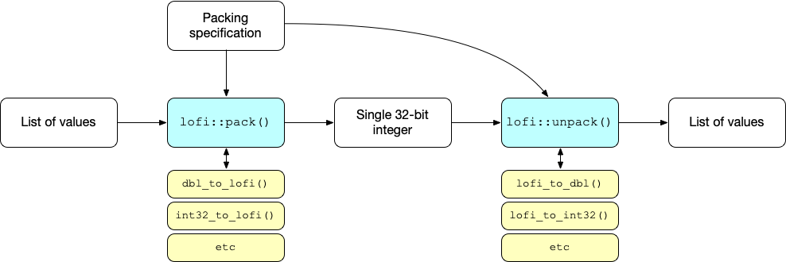
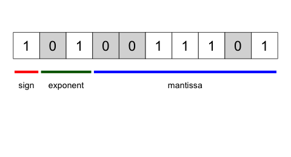
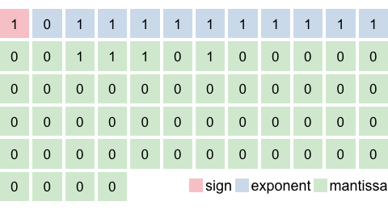
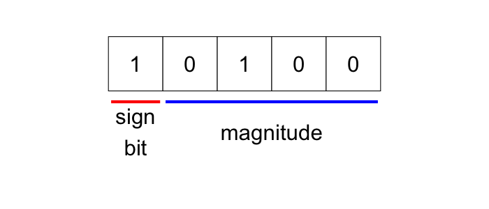

<!-- README.md is generated from README.Rmd. Please edit that file -->

```{r, include = FALSE}
knitr::opts_chunk$set(
  collapse = TRUE,
  comment = "#>",
  fig.path = "man/figures/README-",
  out.width = "100%"
)

suppressPackageStartupMessages({
  library(purrr)
  library(dplyr)
  
  library(exhibitionist)
  library(lofi)
})
```


```{r echo = FALSE, eval = FALSE}
# Quick logo generation. Borrowed heavily from Nick Tierney's Syn logo process
library(magick)
library(showtext)
font_add_google("Abril Fatface", "gf")


# pkgdown::build_site(override = list(destination = "../coolbutuseless.github.io/package/lofi"))
```


```{r echo = FALSE, eval = FALSE}
img <- image_read("man/figures/tape.png") %>%
  image_transparent(color = "#f9fafb", fuzz = 10) %>%
  image_trim() %>%
  image_threshold()


hexSticker::sticker(subplot  = img,
                    s_x      = 1,
                    s_y      = 0.75,
                    s_width  = 1.35,
                    s_height = 0.65,
                    package  = "lofi",
                    p_x      = 1,
                    p_y      = 1.4,
                    p_color  = "#223344",
                    p_family = "gf",
                    p_size   = 12,
                    h_size   = 1.2,
                    h_fill   = "#ffffff",
                    h_color  = "#223344",
                    filename = "man/figures/logo.png")

image_read("man/figures/logo.png")
```


# lofi   

<!-- badges: start -->


[](https://travis-ci.org/coolbutuseless/lofi)
[](https://codecov.io/gh/coolbutuseless/lofi?branch=master)
<!-- badges: end -->

The goal of `lofi` is to squeeze multiple, low-fidelity representations of colours 
and numbers into the 32-bits of a single, standard integer in R.

This low-fidelity representation of values (a.k.a. *lofi*) is usually only an 
approximation of the original values, and reconstructed values will most likely
be slightly different from the original.

Visit the [webpage](https://coolbutuseless.github.io/package/lofi/) for more 
in-depth documentation.


## What's in the box


* `pack()` and `unpack()` are the key functions for packing/unpacking multiple 
values into the bits of an integer
* There is a suite of low-level functions for handling each particular supported type
  e.g. `dbl_to_lofi()` and `lofi_to_dbl()`


## Installation

You can install from [GitHub](https://github.com/coolbutuseless/lofi) with:

``` r
# install.packages("devtools")
devtools::install_github("coolbutuseless/lofi")
```


# `pack()` and `unpack()`

The `pack()` function will encode a set of values into the bits 
of a single integer.  The `unpack()` function will reconstruct the original values 
from this single integer.

The schematic below illustrates the method by which a list of values is packed into 
a single integer and then unpacked back into the list of values.  `pack()` and 
`unpack()` in turn rely on some lower level functions `X_to_lofi()` and `lofi_to_X()` 
(as indicated in the yellow boxes).





The key to the process is the **packing specification** (a.k.a. `pack_spec`) 
which defines the type of value you want to store how many bits are 
used to store each value.


Steps for using this package:

1. Define a `pack_spec` defining how each value is converted to lofi
2. Call `pack()` on a named list of values, along with the `pack_spec`
3. Receive back a single integer containing all the packed lofi bits
4. Call `unpack()` on the single integer (along with the `pack_spec`)
5. Receive a list of reconstructed values which are the same as the original values - 
   but maybe with some loss of precision.
   
   
The `pack_spec` defines information on packing the following types:

| type    | lossless? | nbits | description                                   | signed   |
|---------|-----------|-------|-----------------------------------------------|----------|
| integer | Yes       | 1-32  | pack standard integer                         | optional |
| logical | Yes       | 1-32  | standard 1-bit logical. zero-padded if needed | NA       |
| choice  | Yes       | 1-32  | almost like a factor representation           | NA       |
| double  | No        | 1-32  | pack a standard double                        | optional |
| colour  | No        | 3-24  | pack a hex colour e.g. #123456                | NA       |
| scaled  | No        | 1-32  | pack a range into the given bits              | NA       |
| custom  | Possibly  | 1-32  | user specified functions used to pack/unpack  | NA       |

The integer, logical and choice types are lossless, and original values can be perfectly reconstructed 
by `unpack()`.  The double, colour and scaled types all quantize the inputs in some 
way and lose information - thus the original value is always *imperfectly* reconstructed (except 
in very particular circumstances).

For information on the specification for each type, see `?lofi::pack` or [`vignette("packing-specification", package='lofi'`](https://coolbutuseless.github.io/package/lofi/articles/packing-specification.html)

## Example - `pack/unpack` the first row of `iris` data

The `iris` dataset gives the measurements in cm of the variables sepal length and width,
and petal length and width, respectively, for 50 flowers from each of 3 species of iris.
The first rows of the data are shown below:

```{r echo = FALSE}
knitr::kable(head(iris, 3), caption = "First rows of iris data")
```

The `pack_spec` for the data seen in iris is:

* `Sepal.Length` is a floating point value with 1 decimal place with a maximum value of 7.9.
   This could be multiplied by 10, converted to an integer and stored in 7 bits.
* Similarly for `Sepal.Width`, `Petal.Length` and `Petal.Width` - after multiplying by 10, and
  treating as an integer, these values could all by stored in 6, 7, and 5 bits respectively.
* `Species` is a choice from 3 options, so in the best case we only need 2 bits to store this information.

The defined `pack_spec` is stored as a list:

```{r}
#~~~~~~~~~~~~~~~~~~~~~~~~~~~~~~~~~~~~~~~~~~~~~~~~~~~~~~~~~~~~~~~~~~~~~~~~~~~~~
# Can perfectly pack 'iris' into 27 bits per row.
#~~~~~~~~~~~~~~~~~~~~~~~~~~~~~~~~~~~~~~~~~~~~~~~~~~~~~~~~~~~~~~~~~~~~~~~~~~~~~
pack_spec <- list(
  Sepal.Length = list(type = 'integer', nbits = 7, mult = 10, signed = FALSE),
  Sepal.Width  = list(type = 'integer', nbits = 6, mult = 10, signed = FALSE),
  Petal.Length = list(type = 'integer', nbits = 7, mult = 10, signed = FALSE),
  Petal.Width  = list(type = 'integer', nbits = 5, mult = 10, signed = FALSE),
  Species      = list(type = 'choice' , nbits = 2,
                      options = c('setosa', 'versicolor', 'virginica'))
)
```


Now take the first row of `iris` and `pack()` it:

```{r}
lofi::pack(iris[1, ], pack_spec)
```


```{r include = FALSE}
bits <- as.integer(lofi:::int32_to_bits(54052616L))

chars_df <- tibble(
  char = bits,
  x    = seq_along(char)
)

annotation_df <- tribble(
  ~start, ~end, ~text, ~segment, ~label            , ~segment_colour, ~segment_size, ~text_y,
       1,    5,  TRUE,     TRUE, "unused"      , 'blue'            ,             2,   -0.75,
       6,   12,  TRUE,     TRUE, "Sepal.Length", 'darkred'         ,             2,   -0.75,
      13,   18,  TRUE,     TRUE, "Sepal.Width ", 'blue'            ,             2,   -0.75,
      19,   25,  TRUE,     TRUE, "Petal.Length", 'darkred'         ,             2,   -0.75,
      26,   30,  TRUE,     TRUE, "Petal.Width ", 'blue'            ,             2,   -0.75,
      31,   32,  TRUE,     TRUE, "Species"     , 'darkred'         ,             2,   -0.75
)


png("man/figures/iris-bits.png", width = 800, height = 100)
  plot_chars(chars_df, annotation_df, base_size = 5) + 
    ggplot2::ylim(-2, 1.5)
dev.off()
```


So the first row of iris has now been packed into the integer: **54052616**.  
If this integer is viewed as the 32 bits which make it up, the different lofi data 
representations can be identified:


If the integer is now **`unpack()ed`**, we get back the original data.

```{r}
lofi::unpack(54052616L, pack_spec)
```


For an example of using `lofi` to pack an entire data.frame see [`vignette("packing-a-data-frame", package='lofi')`](https://coolbutuseless.github.io/package/lofi/articles/packing-a-data-frame.html)


# Conversion to/from low-fidelity representation

Underneath `pack()` an `unpack()` is a suite of low-level functions for 
handling each particular supported type

* `dbl_to_lofi()`, `lofi_to_dbl()`
* `int32_to_lofi()`, `lofi_to_int32()`
* `hex_colour_to_lofi()`, `lofi_to_hex_colour()`
* `lgl_to_lofi()`, `lofi_to_lgl()`
* `choice_to_lofi()`, `lofi_to_choice()`


## 64-bit (double precision) floating point to Lofi

Double precision floating point values are converted to low-fidelity representation
by truncating the mantissa, and re-encoding the exponent.  Low-fidelity floats 
have limited range, poorer precision, and will almost never give back the exact
starting value when `unpack()ed`.

Note: `lofi` has no explicit support for `NA`, `NaN`, `Inf` or [denormalized numbers](https://en.wikipedia.org/wiki/Denormal_number).

The following converts a double into a 10 bit float (with a sign bit, 2-bit exponent and 7-bit mantissa).
The reconstructed double is close to the original value, but not an exact match.

```{r include = FALSE}
(lofi <- dbl_to_lofi(-1.234, float_bits = c(1, 2, 7)))


recon <- lofi_to_dbl(lofi, float_bits = c(1, 2, 7))


png("man/figures/compact-float1.png", height = 260)
  exhibitionist::plot_compact_double(-1.234, base_size = 6)
dev.off()


png("man/figures/compact-float2.png", height = 260)
  exhibitionist::plot_float(lofi, float_bits = c(1, 2, 7), base_size = 8)
dev.off()


png("man/figures/compact-float3.png", height = 260)
  exhibitionist::plot_compact_double(recon, base_size = 6)
dev.off()

```


| Representation              | Bits | Value   | Bit layout |
|-----------------------------|------| ---------|-----------------------------|
| Double precision            | 64   |  -1.234  |  |
| Lofi double `dbl_to_lofi(-1.234, float_bits = c(1, 2, 7))` | 10 | 669L |  | 
| Reconstructed double  `lofi_to_dbl(669L, float_bits = c(1, 2, 7))` | 64 | -1.226562 | | 


For more example of using `lofi` to pack double precision floating point values see [`vignette("lofi-double", package='lofi')`](https://coolbutuseless.github.io/package/lofi/articles/lofi-double.html)


## RGB Hex Colour to Lofi

* Hex colours are converted to lofi representation by considering each of the three 8-bit colour channels
  and quantizing the value into fewer bits.
* The number of bits can be specified individually for the separate R, G and B colours.
* The folowing shows that the reconstructed colour isn't identical to the original, but 
  it is still a reasonable approximation.

```{r include = FALSE}
input  <- c('#123456', '#654321') # blue and brown
(lofi  <- hex_colour_to_lofi(input, rgb_bits = c(3, 3, 2)))

show_bits(lofi[1], 8)
show_bits(lofi[2], 8)

output <- lofi_to_hex_colour(lofi,  rgb_bits = c(3, 3, 2))
output
```


```{r echo = FALSE, message = FALSE, warning = FALSE, include = FALSE}
png("man/figures/swatch1.png", height = 100, width = 400); 
  plot_palette( input[1], height = 100, width = 400, ncol = 1, xfraction = 1, yfraction = 1); 
dev.off();


png("man/figures/swatch2.png", height = 100, width = 400); 
  plot_palette(output[1], height = 100, width = 400, ncol = 1, xfraction = 1, yfraction = 1); 
dev.off();


library(exhibitionist)

bits <- as.integer(lofi:::lofi_to_bits(5L, 8))

chars_df <- tibble(
  char = bits,
  x    = seq_along(char)
)

annotation_df <- tribble(
  ~start, ~end, ~text, ~segment, ~label , ~segment_colour, ~segment_size, 
       1,    3,  TRUE,     TRUE, "Red"  , 'red'          , 2,
       4,    6,  TRUE,     TRUE, "Green", 'green'        , 2,
       7,    8,  TRUE,     TRUE, "Blue" , 'blue'         , 2
)


png("man/figures/colour-bits.png", width = 700, height = 200)
plot_chars(chars_df, annotation_df) + ggplot2::ylim(-2, 1.5)
dev.off()

```


| Representation              | Bits | Value   | Colour sample or bit layout |
|-----------------------------|------| ---------|-----------------------------|
| Original colour        | 24 | #123456 | |
| Low-fidelity colour `hex_colour_to_lofi('#123456', rgb_bits = c(3, 3, 2)))` |  8 | 5L       | |
| Reconstructed colour `lofi_to_hex_colour(5L,  rgb_bits = c(3, 3, 2))`               | 24 | #002455 | |


For more example of using `lofi` to pack colours see [`vignette("lofi-colour", package='lofi')`](https://coolbutuseless.github.io/package/lofi/articles/lofi-colour.html)


## Integer to Lofi

* Integers are converted to low-fidelity representation by truncacting any leading zeros
  (or, in the case of negative numbers, truncating the leading ones)
* Keeping a leading bit for the sign is optional, and if it is excluded then the 
  lofi representation is only able to hold positive numbers
* `lofi` correctly keeps the sign bit and twos-complement for negative values

```{r include = FALSE}
(lofi <- int32_to_lofi(12L, nbits = 5, signed = TRUE))

show_bits(lofi, 5)

lofi_to_int32(lofi, nbits = 5, signed = TRUE)
```


```{r include = FALSE}
bits <- as.integer(lofi:::lofi_to_bits(20L, 5))

chars_df <- tibble(
  char = bits,
  x    = seq_along(char)
)

annotation_df <- tribble(
  ~start, ~end, ~text, ~segment, ~label            , ~segment_colour, ~segment_size, ~text_y,
       1,    1,  TRUE,     TRUE, "sign\nbit"       , 'red'          ,             2,   -0.75,
       2,    5,  TRUE,     TRUE, "magnitude"       , 'blue'         ,             2,   -0.75
)


png("man/figures/integer-bits.png", width = 700, height = 300)
plot_chars(chars_df, annotation_df) + ggplot2::ylim(-2, 1.5)
dev.off()
```


| Representation | Bits | Value | bit layout | 
|-----------------|------|-------|-----------|
| Original integer  | 32  | -12  |            |
| Low-fidelity integer `int32_to_lofi(-12L, nbits = 5, signed = TRUE)` | 5 | 20L |  |
| Reconstructed integer `lofi_to_int32(20, nbits = 5, signed = TRUE)` | 32 | -12 | |


## Choice to Lofi

* Convert a value into a zero-based index into a list of options.
* This is similar in idea to how a `factor` works in R

```{r}
options <- c('apple', 'banana', 'carrot', 'dog')
choice  <- c('apple', 'apple', 'dog')

(lofi   <- choice_to_lofi(choice, options))

lofi_to_choice(lofi  , options)
```


# Caveats + Future

* The `pack/unpack` spec is limited to 32-bits as 
    a. this is my use case.
    b. that's the maximum number of bits in an R integer
    c. `double` values are 64-bits but they don't have built-in support for bitwise
       logical operations like `bitwAnd()` etc.
* It should be possible to instead pack/unpack values into a unlimited stream of 
  `raw` bytes.  This may be considered for future versions.
* Factors can not be directly packed. You will have to convert to another
  representation (e.g. character) and encode with `choice_to_lofi()`.


