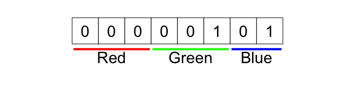
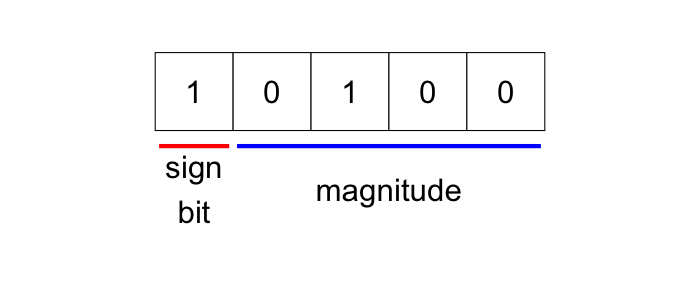

```{r, include = FALSE}
knitr::opts_chunk$set(
  collapse = TRUE,
  comment = "#>"
)

suppressPackageStartupMessages({
  library(dplyr)
  library(exhibitionist)
  library(lofi)
})
```

```{r setup}
library(lofi)
```


# Conversion to/from low-fidelity representation

Underneath `pack()` an `unpack()` is a suite of low-level functions for 
handling each particular supported type

* `dbl_to_lofi()`, `lofi_to_dbl()`
* `int32_to_lofi()`, `lofi_to_int32()`
* `hex_colour_to_lofi()`, `lofi_to_hex_colour()`
* `lgl_to_lofi()`, `lofi_to_lgl()`
* `choice_to_lofi()`, `lofi_to_choice()`


## 64-bit (double precision) floating point to Lofi

Double precision floating point values are converted to low-fidelity representation
by truncating the mantissa, and re-encoding the exponent.  Low-fidelity floats 
have limited range, poorer precision, and will almost never give back the exact
starting value when `unpack()ed`.

The following converts a double into a 10 bit float (with a sign bit, 2-bit exponent and 7-bit mantissa).
The reconstructed double is close to the original value, but not an exact match.

```{r include = FALSE}
(lofi <- dbl_to_lofi(-1.234, float_bits = c(1, 2, 7)))


recon <- lofi_to_dbl(lofi, float_bits = c(1, 2, 7))


png("man/figures/compact-float1.png", height = 260)
  exhibitionist::plot_compact_double(-1.234, base_size = 6)
dev.off()


png("man/figures/compact-float2.png", height = 260)
  exhibitionist::plot_float(lofi, float_bits = c(1, 2, 7), base_size = 8)
dev.off()


png("man/figures/compact-float3.png", height = 260)
  exhibitionist::plot_compact_double(recon, base_size = 6)
dev.off()

```


| Representation              | Bits | Value   | Bit layout |
|-----------------------------|------| ---------|-----------------------------|
| Double precision            | 64   |  -1.234  |  |
| Lofi double `dbl_to_lofi(-1.234, float_bits = c(1, 2, 7))` | 10 | 669L |  | 
| Reconstructed double  `lofi_to_dbl(669L, float_bits = c(1, 2, 7))` | 64 | -1.226562 | | 


## RGB Hex Colour to Lofi

* Hex colours are converted to lofi representation by considering each of the three 8-bit colour channels
  and quantizing the value into fewer bits.
* The number of bits can be specified individually for the separate R, G and B colours.
* The folowing shows that the reconstructed colour isn't identical to the original, but 
  it is still a reasonable approximation.

```{r include = FALSE}
input  <- c('#123456', '#654321') # blue and brown
(lofi  <- hex_colour_to_lofi(input, rgb_bits = c(3, 3, 2)))

show_bits(lofi[1], 8)
show_bits(lofi[2], 8)

output <- lofi_to_hex_colour(lofi,  rgb_bits = c(3, 3, 2))
output
```


```{r echo = FALSE, message = FALSE, warning = FALSE, include = FALSE}
png("man/figures/swatch1.png", height = 100, width = 400); 
  plot_palette( input[1], height = 100, width = 400, ncol = 1, xfraction = 1, yfraction = 1); 
dev.off();


png("man/figures/swatch2.png", height = 100, width = 400); 
  plot_palette(output[1], height = 100, width = 400, ncol = 1, xfraction = 1, yfraction = 1); 
dev.off();


bits <- as.integer(lofi:::lofi_to_bits(5L, 8))

chars_df <- tibble(
  char = bits,
  x    = seq_along(char)
)

annotation_df <- tribble(
  ~start, ~end, ~text, ~segment, ~label , ~segment_colour, ~segment_size, 
       1,    3,  TRUE,     TRUE, "Red"  , 'red'          , 2,
       4,    6,  TRUE,     TRUE, "Green", 'green'        , 2,
       7,    8,  TRUE,     TRUE, "Blue" , 'blue'         , 2
)


png("man/figures/colour-bits.png", width = 700, height = 200)
exhibitionist::plot_chars(chars_df, annotation_df) + ggplot2::ylim(-2, 1.5)
dev.off()

```


| Representation              | Bits | Value   | Colour sample or bit layout |
|-----------------------------|------| ---------|-----------------------------|
| Original colour        | 24 | #123456 | |
| Low-fidelity colour `hex_colour_to_lofi('#123456', rgb_bits = c(3, 3, 2)))` |  8 | 5L       | |
| Reconstructed colour `lofi_to_hex_colour(5L,  rgb_bits = c(3, 3, 2))`               | 24 | #002455 | |


## Integer to Lofi

* Integers are converted to low-fidelity representation by truncacting any leading zeros
  (or, in the case of negative numbers, truncating the leading ones)
* Keeping a leading bit for the sign is optional, and if it is excluded then the 
  lofi representation is only able to hold positive numbers
* `lofi` correctly keeps the sign bit and twos-complement for negative values

```{r include = FALSE}
(lofi <- int32_to_lofi(12L, nbits = 5, signed = TRUE))

show_bits(lofi, 5)

lofi_to_int32(lofi, nbits = 5, signed = TRUE)
```


```{r include = FALSE}
bits <- as.integer(lofi:::lofi_to_bits(20L, 5))

chars_df <- tibble(
  char = bits,
  x    = seq_along(char)
)

annotation_df <- tribble(
  ~start, ~end, ~text, ~segment, ~label            , ~segment_colour, ~segment_size, ~text_y,
       1,    1,  TRUE,     TRUE, "sign\nbit"       , 'red'          ,             2,   -0.75,
       2,    5,  TRUE,     TRUE, "magnitude"       , 'blue'         ,             2,   -0.75
)


png("man/figures/integer-bits.png", width = 700, height = 300)
exhibitionist::plot_chars(chars_df, annotation_df) + ggplot2::ylim(-2, 1.5)
dev.off()
```


| Representation | Bits | Value | bit layout | 
|-----------------|------|-------|-----------|
| Original integer  | 32  | -12  |            |
| Low-fidelity integer `int32_to_lofi(-12L, nbits = 5, signed = TRUE)` | 5 | 20L |  |
| Reconstructed integer `lofi_to_int32(20, nbits = 5, signed = TRUE)` | 32 | -12 | |


## Choice to Lofi

* Convert a value into a zero-based index into a list of options.
* This is similar in idea to how a `factor` works in R

```{r}
options <- c('apple', 'banana', 'carrot', 'dog')
choice  <- c('apple', 'apple', 'dog')

(lofi   <- choice_to_lofi(choice, options))

lofi_to_choice(lofi  , options)
```
