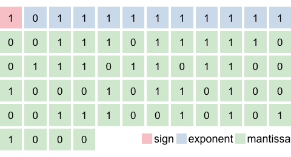
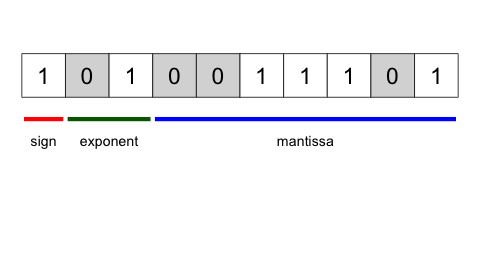
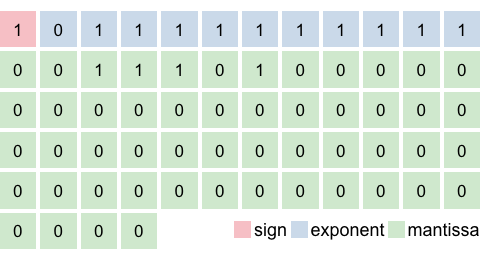

```{r, include = FALSE}
knitr::opts_chunk$set(
  collapse = FALSE,
  comment = "#>"
)
```

```{r setup}
library(lofi)
```


# Introduction

Double precision floating point values in R are stored in 64-bits - 1 bit sign, 
11 for the exponent and 52 for the mantissa.

To convert to a low-fidelity representation, bits are dropped from the exponent 
and mantissa.  This operation obviously results in a loss of precision in the 
number stored.


Note: `lofi` has no explicit detection or support for `NA`, `NaN`, `Inf` or [denormalized numbers](https://en.wikipedia.org/wiki/Denormal_number).

## Double to 10-bit Lofi

Double precision floating point values are converted to low-fidelity representation
by truncating the mantissa, and re-encoding the exponent.  Low-fidelity floats 
have limited range, poorer precision, and will almost never give back the exact
starting value when `unpack()ed`.

The following converts a double into a 10 bit float (with a sign bit, 2-bit exponent and 7-bit mantissa).
The reconstructed double is close to the original value, but not an exact match.

```{r include = FALSE}
(lofi <- dbl_to_lofi(-1.234, float_bits = c(1, 2, 7)))


recon <- lofi_to_dbl(lofi, float_bits = c(1, 2, 7))


png("man/figures/compact-float1.png", height = 260)
  exhibitionist::plot_compact_double(-1.234, base_size = 6)
dev.off()


png("man/figures/compact-float2.png", height = 260)
  exhibitionist::plot_float(lofi, float_bits = c(1, 2, 7), base_size = 8)
dev.off()


png("man/figures/compact-float3.png", height = 260)
  exhibitionist::plot_compact_double(recon, base_size = 6)
dev.off()

```


| Representation              | Bits | Value   | Bit layout |
|-----------------------------|------| ---------|-----------------------------|
| Double precision            | 64   |  -1.234  |  |
| Lofi double `dbl_to_lofi(-1.234, float_bits = c(1, 2, 7))` | 10 | 669L |  | 
| Reconstructed double  `lofi_to_dbl(669L, float_bits = c(1, 2, 7))` | 64 | -1.226562 | | 


## Double to 8-bit Lofi

A common 8-bit float (as described [here](http://www.cs.jhu.edu/~jorgev/cs333/readings/8-Bit_Floating_Point.pdf)) has 1-bit for the sign, 3-bits for the exponent and 4-bits for the mantissa.

This 8-bit float has a range of [-15.5, 15.5] and pretty terrible precision.

```{r echo = FALSE}
set.seed(1)
```

```{r}
(original       <- round(runif(10, min = -15, max = 15), 3))
(lofi_values   <- dbl_to_lofi(original, float_bits = c(1, 3, 4)))
(reconstructed <- lofi_to_dbl(lofi_values, float_bits = c(1, 3, 4)))
abs(reconstructed - original)
```


