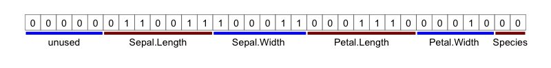

```{r, include = FALSE}
knitr::opts_chunk$set(
  collapse = TRUE,
  comment = "#>"
)
```

```{r setup}
suppressPackageStartupMessages({
  library(ggplot2)
  library(lobstr)
  library(dplyr)
  library(purrr)
  library(exhibitionist)
  library(lofi)
})
```


# Introduction

In this vignette, `lofi` is used to pack each row of the `iris` data into an integer.

Steps:

1. Create a `pack_spec` for one row
2. `pack()`/`unpack()` a single row to test if it works
3. Use `purrr::map()` to apply the packing to every row.


# Create a pack spec

The `iris` dataset gives the measurements in cm of the variables sepal length and width,
and petal length and width, respectively, for 50 flowers from each of 3 species of iris.
The first rows of the data are shown below:

```{r echo = FALSE}
knitr::kable(head(iris, 3), caption = "First rows of iris data")
```

The `pack_spec` for the data seen in iris is:

* `Sepal.Length` is a floating point value with 1 decimal place with a maximum value of 7.9.
   This could be multiplied by 10, converted to an integer and stored in 7 bits.
* Similarly for `Sepal.Width`, `Petal.Length` and `Petal.Width` - after multiplying by 10, and
  treating as an integer, these values could all by stored in 6, 7, and 5 bits respectively.
* `Species` is a choice from 3 options, so in the best case we only need 2 bits to store this information.

The defined `pack_spec` is stored as a list:

```{r}
#~~~~~~~~~~~~~~~~~~~~~~~~~~~~~~~~~~~~~~~~~~~~~~~~~~~~~~~~~~~~~~~~~~~~~~~~~~~~~
# Can perfectly pack 'iris' into 27 bits per row.
#~~~~~~~~~~~~~~~~~~~~~~~~~~~~~~~~~~~~~~~~~~~~~~~~~~~~~~~~~~~~~~~~~~~~~~~~~~~~~
pack_spec <- list(
  Sepal.Length = list(type = 'integer', nbits = 7, mult = 10, signed = FALSE),
  Sepal.Width  = list(type = 'integer', nbits = 6, mult = 10, signed = FALSE),
  Petal.Length = list(type = 'integer', nbits = 7, mult = 10, signed = FALSE),
  Petal.Width  = list(type = 'integer', nbits = 5, mult = 10, signed = FALSE),
  Species      = list(type = 'choice' , nbits = 2,
                      options = c('setosa', 'versicolor', 'virginica'))
)
```


# Pack/unpack a single row

Now take the first row of `iris` and `pack()` it:

```{r}
lofi::pack(iris[1, ], pack_spec)
```


```{r include = FALSE}
bits <- as.integer(lofi:::int32_to_bits(54052616L))

chars_df <- tibble(
  char = bits,
  x    = seq_along(char)
)

annotation_df <- tribble(
  ~start, ~end, ~text, ~segment, ~label            , ~segment_colour, ~segment_size, ~text_y,
       1,    5,  TRUE,     TRUE, "unused"      , 'blue'            ,             2,   -0.75,
       6,   12,  TRUE,     TRUE, "Sepal.Length", 'darkred'         ,             2,   -0.75,
      13,   18,  TRUE,     TRUE, "Sepal.Width ", 'blue'            ,             2,   -0.75,
      19,   25,  TRUE,     TRUE, "Petal.Length", 'darkred'         ,             2,   -0.75,
      26,   30,  TRUE,     TRUE, "Petal.Width ", 'blue'            ,             2,   -0.75,
      31,   32,  TRUE,     TRUE, "Species"     , 'darkred'         ,             2,   -0.75
)


png("../man/figures/iris-bits.png", width = 800, height = 100)
  plot_chars(chars_df, annotation_df, base_size = 5) + 
    ggplot2::ylim(-2, 1.5)
dev.off()
```


So the first row of iris has now been packed into the integer: **54052616**.  
If this integer is viewed as the 32 bits which make it up, the different lofi data 
representations can be identified:




If the integer is now **`unpack()ed`**, we get back the original data.

```{r}
lofi::unpack(54052616L, pack_spec)
```


# `pack/unpack` every row

`pack/unpack` may be mapped over the rows of a data.frame to encode every row
as a single integer value.

In the following example, each row of the `iris` data is encoded as a single
32-bit integer value. 

The packed lofi representation of iris is **~12x smaller** than the original data.frame.


```{r}
#~~~~~~~~~~~~~~~~~~~~~~~~~~~~~~~~~~~~~~~~~~~~~~~~~~~~~~~~~~~~~~~~~~~~~~~~~~~~~
# Pack the entire data.frame one row at a time using 'transpose' + 'map'
# `lofi` does not handle factors, so convert 'Species' explicitly to a character
#~~~~~~~~~~~~~~~~~~~~~~~~~~~~~~~~~~~~~~~~~~~~~~~~~~~~~~~~~~~~~~~~~~~~~~~~~~~~~
iris_packed <- iris %>%
  mutate(Species = as.character(Species)) %>% 
  transpose() %>%
  map_int(pack, pack_spec)

#~~~~~~~~~~~~~~~~~~~~~~~~~~~~~~~~~~~~~~~~~~~~~~~~~~~~~~~~~~~~~~~~~~~~~~~~~~~~~
# 'iris' is now encoded as a vector of ints
#~~~~~~~~~~~~~~~~~~~~~~~~~~~~~~~~~~~~~~~~~~~~~~~~~~~~~~~~~~~~~~~~~~~~~~~~~~~~~
head(iris_packed, 21)

#~~~~~~~~~~~~~~~~~~~~~~~~~~~~~~~~~~~~~~~~~~~~~~~~~~~~~~~~~~~~~~~~~~~~~~~~~~~~~
# Packed representation is smaller by a factor of 10
#~~~~~~~~~~~~~~~~~~~~~~~~~~~~~~~~~~~~~~~~~~~~~~~~~~~~~~~~~~~~~~~~~~~~~~~~~~~~~
as.numeric(lobstr::obj_size(iris) / lobstr::obj_size(iris_packed)) 

#~~~~~~~~~~~~~~~~~~~~~~~~~~~~~~~~~~~~~~~~~~~~~~~~~~~~~~~~~~~~~~~~~~~~~~~~~~~~~
# And can unpack the integers into the original data.frame representation
#~~~~~~~~~~~~~~~~~~~~~~~~~~~~~~~~~~~~~~~~~~~~~~~~~~~~~~~~~~~~~~~~~~~~~~~~~~~~~
iris_packed %>%
  map(unpack, pack_spec) %>%
  bind_rows() %>%
  head()
```
